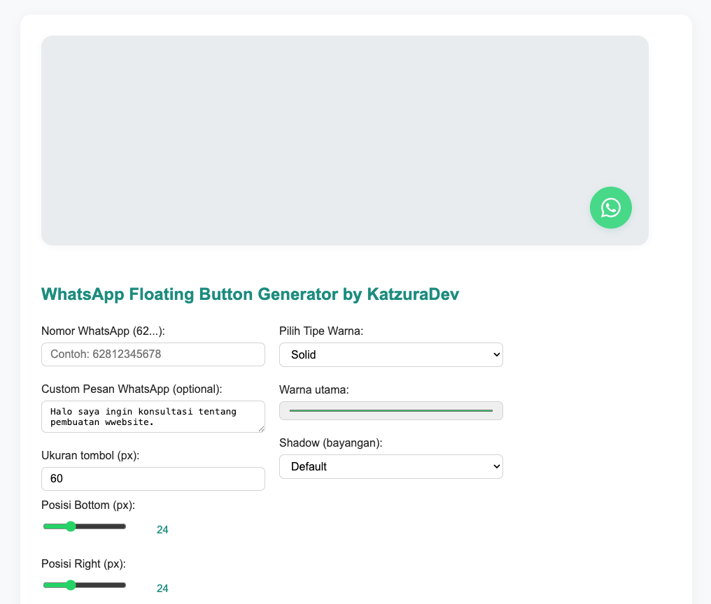

# WhatsApp Floating Button Generator

Aplikasi web untuk membuat dan mengkustomisasi tombol floating WhatsApp yang siap untuk diintegrasikan ke website Anda.


## 📋 Daftar Isi

- [Fitur](#fitur)
- [Preview](#preview)
- [Cara Penggunaan](#cara-penggunaan)
- [Konfigurasi](#konfigurasi)
- [Instalasi](#instalasi)
- [Integrasi](#integrasi)
- [Author](#author)

## ✨ Fitur

### Konfigurasi Tombol

- ✅ **Nomor WhatsApp** - Input nomor dengan format +62 atau 62
- ✅ **Pesan Otomatis** - Atur pesan default yang dikirim saat tombol diklik
- ✅ **Ukuran Tombol** - Sesuaikan ukuran dari 40px hingga 100px
- ✅ **Posisi Floating** - Kontrol posisi bottom dan right dengan slider
- ✅ **Warna Solid/Gradient** - Pilih warna tunggal atau gradient
- ✅ **Efek Shadow** - 4 pilihan bayangan (Default, Soft, Strong, None)
- ✅ **Live Preview** - Lihat perubahan secara real-time
- ✅ **Copy to Clipboard** - Salin HTML code dengan satu klik

### Fitur Teknis

- Responsive design (mobile-friendly)
- Validasi nomor WhatsApp otomatis
- URL encoding untuk pesan khusus
- Fallback untuk browser lama
- Smooth animations dan transitions
- Accessibility dengan ARIA labels

## 📸 Preview

### Interface Aplikasi



**Tampilan Preview:**

- Layar preview di sebelah kiri menampilkan tombol floating dalam ukuran sebenarnya
- Form kontrol di sebelah kanan untuk mengatur semua parameter
- Live update - setiap perubahan langsung terlihat di preview

### Contoh Konfigurasi

```
Nomor WhatsApp: 62812345678
Pesan: Halo, saya ingin konsultasi tentang pembuatan website.
Ukuran: 60px
Posisi Bottom: 24px
Posisi Right: 24px
Warna: #25D366 (Hijau WhatsApp)
Shadow: Default
```

## 🚀 Cara Penggunaan

### 1. Buka Aplikasi

Buka file `index.html` di browser Anda atau akses melalui server lokal.

### 2. Atur Konfigurasi

- **Nomor WhatsApp**: Masukkan nomor dengan awalan 62 (contoh: `62812345678`)
- **Pesan (Opsional)**: Tulis pesan yang ingin dikirim otomatis
- **Ukuran Tombol**: Gunakan input number atau geser slider
- **Posisi**: Sesuaikan jarak dari bawah dan kanan dengan slider
- **Warna**: Pilih warna dari color picker
- **Shadow**: Pilih efek bayangan dari dropdown

### 3. Preview Real-time

Tombol di sebelah kiri akan update secara otomatis sesuai konfigurasi Anda.

### 4. Copy Code

Klik tombol **"Copy"** untuk menyalin HTML code ke clipboard.

### 5. Paste ke Website

Paste code di bagian akhir `<body>` website Anda sebelum `</body>`.

## ⚙️ Konfigurasi

### Parameter Tombol

| Parameter      | Range                          | Default  | Deskripsi                            |
| -------------- | ------------------------------ | -------- | ------------------------------------ |
| Nomor WhatsApp | 62xxxxxxxx                     | -        | Nomor dengan format internasional    |
| Pesan          | Max 200 char                   | (kosong) | Pesan yang dikirim otomatis          |
| Ukuran         | 40-100 px                      | 60       | Ukuran diameter tombol               |
| Posisi Bottom  | 0-100 px                       | 24       | Jarak dari bawah halaman             |
| Posisi Right   | 0-100 px                       | 24       | Jarak dari kanan halaman             |
| Tipe Warna     | Solid / Gradient               | Solid    | Solid color atau gradient            |
| Warna Utama    | Hex color                      | #25D366  | Warna utama tombol                   |
| Warna Kedua    | Hex color                      | #128C7E  | Warna gradient (jika gradient aktif) |
| Arah Gradient  | to right / to bottom / 135deg  | to right | Arah gradient                        |
| Shadow         | default / soft / strong / none | default  | Efek bayangan                        |

### Contoh Output Code

```html
<button
  style="width:60px;height:60px;position:fixed;bottom:24px;right:24px;display:flex;align-items:center;justify-content:center;border-radius:50%;border:none;z-index:9999;background:#25d366;box-shadow:0 3px 10px rgba(18,140,126,0.22);"
  onclick="window.open('https://wa.me/62812345678?text=Halo','_blank')"
  aria-label="Chat WhatsApp"
>
  <svg
    xmlns="http://www.w3.org/2000/svg"
    viewBox="0 0 16 16"
    width="28"
    height="28"
  >
    <path fill="#fff" d="..." />
  </svg>
</button>
```

## 💻 Instalasi

### Metode 1: File Lokal

1. Download `index.html`
2. Buka dengan browser favorit Anda
3. Tidak perlu instalasi atau dependency tambahan

### Metode 2: Live Server (VS Code)

1. Install extension "Live Server"
2. Klik kanan pada `index.html`
3. Pilih "Open with Live Server"

## 🔗 Integrasi

### Cara Integrasi ke Website

1. **Copy code dari generator:**

   - Atur semua parameter sesuai keinginan
   - Klik tombol "Copy"

2. **Paste di website Anda:**

   ```html
   <!DOCTYPE html>
   <html>
     <head>
       <title>My Website</title>
     </head>
     <body>
       <h1>Selamat datang</h1>

       <!-- Paste button code di sini -->
       <button style="..." onclick="...">...</button>
     </body>
   </html>
   ```

3. **Validasi:**
   - Buka website di browser
   - Tombol floating WhatsApp akan muncul di sudut kanan bawah
   - Klik untuk test WhatsApp link

### Tips Integrasi

- Pastikan `z-index: 9999` tidak konflik dengan element lain
- Gunakan URL format `https://wa.me/[NOMOR]` untuk kompatibilitas semua device
- Test di berbagai browser dan mobile device
- Jika ada custom CSS, pastikan tidak override button styling

## 📝 Teknologi

- **Frontend**: HTML5, CSS3, Vanilla JavaScript
- **Browser Support**: Chrome, Firefox, Safari, Edge (modern versions)
- **No Dependencies**: Pure HTML/CSS/JS, tidak perlu library eksternal
- **File Size**: < 20KB (minified)

## 🎨 Styling

### CSS Classes & IDs

- `.container` - Main container
- `.preview-area` - Area preview tombol
- `#wa-preview-btn` - Tombol WhatsApp preview
- `.controls` - Form kontrol
- `.code-output` - Output code block
- `.copy-btn` - Tombol copy

### Custom CSS Variables

Dapat di-customize melalui color picker di aplikasi:

- `--main-color`: Warna utama tombol
- `--second-color`: Warna gradient
- `--gradient-dir`: Arah gradient

## 🔍 Validasi

Aplikasi melakukan validasi otomatis:

- ✅ Nomor WhatsApp harus format 62xxxxxxx
- ✅ Minimum 8 digit, maksimal 14 digit
- ✅ Pesan maksimal 200 karakter
- ✅ Ukuran tombol 40-100px
- ✅ Posisi 0-100px

Jika nomor tidak valid:

- Tombol preview menjadi semi-transparent
- Tooltip menampilkan "Nomor belum valid"
- Button tidak bisa diklik

## 🐛 Troubleshooting

### Logo tidak di tengah saat copy-paste

- Pastikan menggunakan browser terbaru
- Copy dari aplikasi (bukan preview)
- Paste ke aplikasi yang support styling HTML inline

### Pesan tidak terkirim

- Check nomor WhatsApp format 62xxxxxxx
- Pastikan pesan tidak mengandung karakter khusus
- Gunakan test di preview terlebih dahulu

### Tombol tidak muncul di website

- Pastikan script ditulis sebelum `</body>`
- Check z-index tidak di-override CSS lain
- Verify nomor WhatsApp sudah valid

## 📄 License

Dibuat oleh **KatzuraDev**

Bebas untuk digunakan dan dimodifikasi untuk keperluan pribadi maupun komersial.

## 🤝 Kontribusi

Untuk menambah fitur atau perbaikan:

1. Fork proyek ini
2. Buat branch fitur baru
3. Commit perubahan Anda
4. Push ke branch
5. Buat Pull Request

## 📧 Kontak

Pertanyaan atau saran? Hubungi melalui:

- Website: [KatzuraDev](https://katzuradev.my.id)
- WhatsApp: Gunakan generator ini untuk hubungi kami!

---

**Happy coding! 🚀 Nikmati kemudahan membuat WhatsApp floating button dengan generator ini.**
